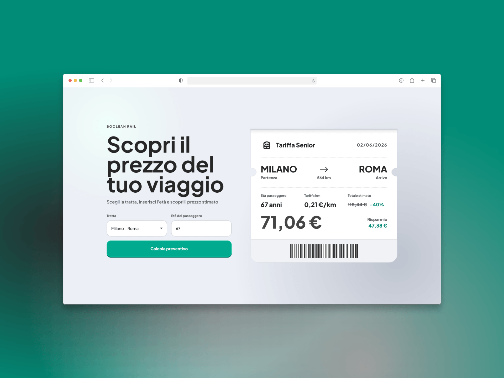

# JS Biglietto Treno Form

Form-based JavaScript exercise from my web development course.

The app estimates a train fare from a selected route distance and passenger age.

## Demo

- [View on GitHub Pages](https://emanuelefavero.github.io/js-biglietto-treno-form/)

## Preview

## Solution

- Open `index.html` in a browser to use the app.
- Form logic is handled in `assets/js/main.js`.
- Calculation helpers are in `assets/js/utils.js`.
- Template functions for rendering the ticket are in `assets/js/templates.js`.
- Styling is in `assets/css/style.css`.

## Assignment

The base exercise asks for:

- the number of kilometers to travel;
- the passenger's age.

The teacher also encouraged us to make the solution our own, either with a
similar implementation or a different approach. This version turns the exercise into a small fare estimator: the user selects a predefined route, and the route distance is used for the original calculation rules:

- base price: `0.21 €` per km;
- `20%` discount for minors;
- `40%` discount for passengers aged 65 or older;
- final price formatted in Euro.

## Milestones

1. Build the calculation with two inputs, one button, and console output.
2. Render the recap and final price directly in the page.
3. Add a polished visual style once the logic is working.

## Test Cases

| Km  | Age | Expected price |
| --- | --- | -------------- |
| 100 | 10  | `16,80 €`      |
| 100 | 30  | `21,00 €`      |
| 100 | 70  | `12,60 €`      |

## Technical Notes

- Routes are handled with a simple `<select>`: each option value stores the km distance.
- Form values are read with `FormData`, validated, and converted with `Number`.
- Price rules, validation, formatting, and ticket labels are split into small helper functions.
- The ticket is rendered from a single data object prepared in `main.js`.
- The ticket shows route, tariff, base price, discount, savings, and final estimated price.
- CSS custom properties, nesting, and semantic class names keep the layout organized and responsive.

&nbsp;

---

&nbsp;

[**Go To Top &nbsp; ⬆️**](#js-biglietto-treno-form)
